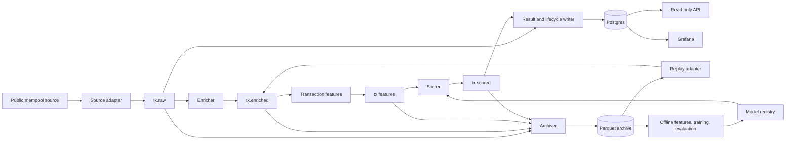

# BlockPulse: project plan and system description

| Document field | Value |
| --- | --- |
| Status | Local Phase 0 and first Phase 1 baseline complete; labeled detection evaluation remains future work |
| Version | 0.7 |
| Created / last updated | 2026-10-09 |
| Intended builder | One developer working part-time |
| Primary environment | Local machine; containers before Kubernetes |
| Hardware assumption | 16 GB RAM, 4 or more CPU cores, SSD; actual capacity remains to be recorded |
| Cloud posture | Optional, temporary experiments; no always-on cloud environment |
| Origin | The supplied Bitcoin anomaly pipeline discussion and system-design draft |
| Role of this document | Canonical reference for the idea, design, scope, implementation sequence, and progress |

This document describes the full intended project. The first local implementation is documented in [Phase 0](PHASE0.md); most later components remain planned. Targets, resource allocations, and schedules are planning assumptions until a measurement is attached. The proposed defaults below make the project actionable without treating every decision in the original discussion as settled.

Quick navigation:

| When you want to... | Read |
| --- | --- |
| Remember the idea and boundaries | [Purpose](#1-project-identity-and-purpose), [scope](#2-scope-and-release-boundaries), and [requirements](#3-requirements-and-success-criteria) |
| Understand how it works | [Architecture](#4-system-architecture) through [feature design](#8-transaction-feature-design) |
| Work on detection | [ML and evaluation](#9-detection-evaluation-and-mlops), then [optional entity analysis](#10-optional-entity-analysis) |
| Operate or deploy it | [Storage/API](#11-storage-and-query-interfaces), [observability](#12-observability-and-failure-behavior), and [deployment](#13-deployment-networking-and-security) |
| Check feasibility and cost | [Hardware](#14-hardware-and-storage-budget) and [financial budget](#15-financial-budget-and-cost-controls) |
| Choose the next work | [Roadmap](#16-implementation-roadmap), [definition of done](#17-verification-and-definition-of-done), and [current status](#21-current-status-and-how-to-resume) |

## 1. Project identity and purpose

**BlockPulse is a real-time Bitcoin transaction anomaly pipeline that combines streaming ingestion, reproducible feature engineering, explainable anomaly screening, and measurable operational behavior.**

It observes transactions reported by a Bitcoin mempool source, records what it actually saw, enriches transaction details, computes structural features, and produces anomaly scores. Interesting results are stored with their features, detector version, and transaction lifecycle evidence so they can be inspected later.

The central question is: **Can we build a small, reliable streaming system that surfaces unusual transaction structures, reproduces its results offline, and demonstrates its latency, failure recovery, detection limits, and cost?**

There are three connected learning goals:

1. **Data engineering:** event contracts, Kafka, backpressure, idempotency, data quality, archival, and replay.
2. **ML engineering:** shared feature definitions, baselines, temporal evaluation, model registration, drift reporting, promotion, and rollback.
3. **Infrastructure and networking:** containers, service connectivity, fault injection, Kubernetes scaling, and a bounded cloud experiment.

Bitcoin gives the project a coherent live-data domain. Kafka and Kubernetes are deliberate learning choices; the initial data volume does not itself require them.

### 1.1 Who uses it

The primary user is the builder operating and investigating the pipeline. A reviewer should also be able to run a recorded demonstration without depending on a live public API or an AWS account.

The main workflows are:

- Start a local environment and see ingestion, enrichment, scores, and pipeline health.
- Inspect an alert and understand which transaction features were unusual.
- Replay an archived interval and reproduce feature vectors and pinned-model scores.
- Compare rules with an ML detector on the same evaluation set.
- Interrupt a component and inspect backlog growth, recovery, and duplicate handling.
- Read a benchmark report showing exactly which configuration produced the results.

### 1.2 What the project will not claim

- Anomalous transactions are not automatically fraudulent, illegal, or malicious.
- An Isolation Forest score is not a calibrated probability of crime.
- A public provider's mempool view is not a complete view of every transaction on the Bitcoin network.
- Inferred address groups are not verified people, businesses, or wallets.
- A single-broker local deployment is not highly available.
- The project does not provide trading signals, custody, transaction broadcasting, or compliance decisions.

Public blockchain data can still be linked to people. Public examples should describe structural patterns and limitations without making accusations about address owners.

## 2. Scope and release boundaries

### 2.1 Core release: a complete local transaction pipeline

The first complete release includes:

- A live source adapter and a recorded-data replay adapter.
- Versioned observation and enrichment schemas.
- Kafka transport with explicit retention and consumer commit behavior.
- Shared transaction feature code used by live processing and offline evaluation.
- A rules/robust-statistics baseline and an Isolation Forest comparison.
- Parquet archives and a small Postgres query store.
- Reproducible training and evaluation, including synthetic structural fixtures.
- A read-only API and Grafana dashboards.
- Model/version metadata, duplicate-safe result writes, and basic recovery tests.
- A documented resource profile and a repeatable demonstration.

The core is successful even if ML does not outperform the baseline. A measured negative result is useful; adding a more complex model to conceal it is outside the plan.

### 2.2 Later extensions

| Extension | Purpose | Entry condition |
| --- | --- | --- |
| Entity analysis | Stateful address grouping and event-time windows | Core complete; usable input coverage and measured memory headroom |
| Local Kubernetes | Scheduling, network policy, lag-based scaling, recovery | Compose behavior understood; host can run the reduced Kubernetes profile |
| Ephemeral AWS | Terraform, IAM, VPC behavior, cost measurement | Local demo reproducible; current quote and teardown procedure recorded |
| Bitcoin Core source | Direct node observation and richer lifecycle experiments | Separate disk, sync, bandwidth, and operating budget established |
| Managed Kafka comparison | Compare operating effort and measured expense | A specific research question and a separate affordable experiment |

### 2.3 Deferred unless a measured need appears

Redis, Flink, deep learning/autoencoders, a custom frontend, multiple managed databases, a permanent EKS cluster, multi-region deployment, commercial entity attribution, and automatic external notifications are deferred.

MinIO provides a local S3-compatible interface, but a filesystem archive is acceptable during the first milestone. MLflow and the trainer do not need to run continuously while establishing ingestion.

## 3. Requirements and success criteria

| ID | Requirement | Acceptance evidence |
| --- | --- | --- |
| F1 | Capture source observations with provenance and timestamps | Recorded fixture, source capability report, visible disconnect/gap intervals |
| F2 | Enrich admitted transactions without exceeding a configured request budget | Measured success rate, 429 handling, bounded concurrency, explicit missing-data outcomes |
| F3 | Compute deterministic transaction features | Versioned spec and live/offline equivalence checks |
| F4 | Score transactions and expose inspectable results | API result includes input features, detector version, threshold, and context |
| F5 | Archive durable pipeline records and replay them | Manifest-backed archive plus replay demonstration |
| F6 | Evaluate baseline and ML methods consistently | Temporal split, injection sweep, real-traffic alert rate, documented manual review |
| F7 | Register, select, and roll back a detector | Model manifest and a demonstrated compatible-version switch |
| F8 | Preserve lifecycle evidence separately from model features | Confirmation/replacement/removal observations do not rewrite historical scoring inputs |
| N1 | Tolerate retries and ordinary process restarts | No duplicate result rows for the same logical key in the test scenarios |
| N2 | Make incomplete coverage visible | Source gaps, sampling, enrichment failures, and archive lag are reported |
| N3 | Fit a local resource budget | Memory, CPU, disk growth, and training peaks measured on the actual host |
| N4 | Remain operable after a break from development | Setup instructions, fixtures, pinned dependencies, and a current progress tracker |

Starting performance goals, to be revised after the source spike:

- Sustain **10 admitted transactions/second in local replay**, with representative payloads, without growing backlog. This is a processing target, not permission to send 10 REST requests/second to a public service.
- Aim for **p99 below 2 seconds from enriched-record availability to persisted score** in the core path at the tested load.
- Separately measure receive-to-score latency, including external enrichment. Aim for p99 below 5 seconds when the source is healthy, but publish actual results and all exclusions.
- Complete at least one **6-hour local observation run** and one repeatable offline demo.
- Demonstrate worker, database, and broker restart behavior, specifying whether persistent volumes survived.
- Publish detection results without claiming a real-world false-positive rate where labels do not exist.

Entity windows have a separate latency target because their intentional lateness buffer adds delay. No performance figure is a completed achievement at this stage.

## 4. System architecture



Replay uses isolated topics and consumer groups in normal experiments. The diagram shows the logical entry point, not permission to mix test traffic into the live namespace.

Prometheus scrapes the services and Kafka lag exporter; Grafana presents those metrics alongside stored results. The optional entity branch reads enriched events and produces separate entity features and scores. It does not join transaction and entity streams before scoring.

### 4.1 Technology choices

| Concern | Proposed default | Reason |
| --- | --- | --- |
| Application code | Python, typed schemas, pytest | One language across parsing, features, ML, and API |
| Event transport | Single-node Apache Kafka in KRaft mode | Learn topic, partition, consumer-group, and recovery behavior |
| Query store | PostgreSQL | Constraints, transactional writes, practical querying |
| Archive | Parquet with Zstandard; local files, then MinIO | Efficient offline analysis and an eventual S3 path |
| Analysis/training | PyArrow or DuckDB; scikit-learn | CPU-friendly dataset inspection and baseline models |
| Experiment tracking | MLflow, introduced after the baseline | Dataset/model lineage, metrics, and registry aliases |
| API | FastAPI | Small read-only interface |
| Monitoring | Prometheus and Grafana | Pipeline health and investigation without building a frontend |
| Local runtime | Docker Compose with optional profiles | Start only what the current milestone needs |
| Later deployment | k3d or kind; KEDA; Terraform | Reuse the application while adding infrastructure exercises |

Pin compatible versions during implementation. These are design selections, not a claim that a working dependency set already exists. Redpanda remains an alternative if a measured Kafka resource problem warrants revisiting the broker decision; do not maintain two implementations initially.

### 4.2 Service boundaries

| Component | Responsibility | Durable output / state |
| --- | --- | --- |
| Source adapter | Connect, validate, timestamp, detect gaps, emit observations | Raw events; source checkpoint where supported |
| Enricher | Fetch missing transaction data, normalize values, apply admission policy | Enriched events or explicit failure records |
| Feature worker | Apply the shared pure feature functions | Feature records with their version |
| Scorer | Validate feature compatibility and apply a pinned detector | Scores with exact detector identity |
| Writer | Persist scores/alerts and reduce lifecycle observations | Postgres rows with unique constraints |
| Archiver | Store replayable records and committed offset ranges | Parquet objects and manifests |
| Trainer/evaluator | Build temporal datasets, compare detectors, register candidates | Model artifacts, reports, dataset manifests |
| API | Serve stored results and operational metadata | No independent model or feature logic |

Start with one replica per component. Several worker roles may share an image/package without becoming independently maintained codebases. Add processes only where the boundary helps testing, resource control, or scaling.

## 5. Source strategy and coverage

### 5.1 Public provider first

Use mempool.space as the initial candidate source. Its published documentation describes both `track-mempool` and `track-mempool-txids`, with lifecycle fields; the latter returns transaction identifiers rather than full transaction bodies. Verify the deployed endpoint and required fields before choosing the subscription. Documentation alone does not establish access limits or sustainable throughput. [Source: mempool API documentation source](https://github.com/mempool/mempool/blob/master/frontend/src/app/docs/api-docs/api-docs-data.ts).

The first implementation task is a small capture-and-measure program, not the entire platform. Record:

- Connection URL, subscription, adapter version, and observation dates.
- Payload examples for each supported event type.
- Availability and semantics of timestamps and sequence numbers.
- Fields already present versus fields requiring REST enrichment.
- Average and burst arrival rates; representative payload-size percentiles.
- Request latency, failure rate, rate-limit responses, and reconnect behavior.
- Whether replacement relationships and block identifiers are actually supplied.

The Esplora API contract is a useful reference for transaction details, confirmation status, and current mempool snapshots. Test the chosen provider rather than assuming every deployment behaves identically. [Source: Esplora API](https://github.com/Blockstream/esplora/blob/master/API.md).

### 5.2 Coverage modes

| Mode | Behavior | Interpretation |
| --- | --- | --- |
| Live, fully admitted | Attempt enrichment for every observed eligible transaction | Coverage of this source's observations, subject to gaps and failures |
| Live, sampled | Deterministically select a fraction of observed transactions | Transaction-level experiment on a stated sample |
| Recorded replay | Process a fixed archived dataset without upstream requests | Reproducible processing and evaluation workload |
| Synthetic evaluation | Inject labeled fixtures only in an isolated evaluation run | Controlled test of specified patterns |

Use a stable cryptographic hash of `txid` for deterministic admission; do not use Python's process-randomized `hash()`. Store the sampling fraction and policy version. Track eligible, admitted, enriched, scored, and failed counts separately.

If sampling is necessary, disable the initial entity extension. Even without deliberate sampling, source outages and enrichment failures can invalidate claims about complete entity histories.

### 5.3 Reconnects and missing history

Reconnect with bounded exponential backoff and jitter. Use provider-supported heartbeats or bounded health probes; a quiet transaction stream by itself is not proof of a dead connection.

After reconnecting, reconcile a current mempool snapshot where the provider supports it and the request cost is acceptable. Deduplicate overlapping observations and record the gap interval.

**A current snapshot cannot reconstruct every transaction that entered and disappeared during an outage.** Gap reconciliation is best effort. Record unknown historical coverage instead of declaring that all missing events were recovered. A bounded local spool can reduce loss after receipt, but does not recover events the source never delivered.

### 5.4 Optional Bitcoin Core source

A later adapter can use Bitcoin Core RPC and ZMQ. The `sequence` topic distinguishes mempool additions/removals and block connections/disconnections; `rawtx` alone is not a complete lifecycle feed. ZMQ notifications can be lost, so sequence tracking and reconciliation are still required. [Source: Bitcoin Core ZMQ documentation](https://github.com/bitcoin/bitcoin/blob/master/doc/zmq.md).

Plan previous-output resolution separately: raw serialized transactions do not contain the values of the outputs they spend. Pruning also does not make a node a general historical transaction API. A mainnet node is a separate operating commitment; a small regtest environment can test lifecycle scenarios without becoming the production data source.

## 6. Data contracts, timestamps, and identity

### 6.1 Common envelope

Every event carries a versioned envelope. Example values below are illustrative:

```json
{
  "schema_version": 1,
  "event_id": "observation-unique-id",
  "parent_event_id": null,
  "run_id": "live-2026-10",
  "source": "mempool-space",
  "source_session_id": "connection-session-id",
  "source_sequence": null,
  "source_mode": "live",
  "event_type": "tx_observed",
  "txid": "transaction-id",
  "source_event_time": null,
  "event_time": "2026-10-08T08:00:00.000Z",
  "event_time_basis": "received_at",
  "received_at": "2026-10-08T08:00:00.000Z",
  "produced_at": "2026-10-08T08:00:00.010Z",
  "sampling_fraction": 1.0,
  "trace_id": "trace-id",
  "payload": {}
}
```

- All stored timestamps use UTC. Keep source time separate from local receive time.
- For the first adapter, use `received_at` as `event_time` unless a documented source timestamp is deliberately selected and versioned.
- `txid` identifies a transaction, not every observation of that transaction. Keep `wtxid` where available if witness-level distinctions become relevant.
- Assign `event_id` once at the ingestion boundary and preserve it on retries. When reliable provider sequence identity exists, include the session/epoch and event index in its construction.
- New provider observations may have new event IDs even for the same transaction. Business-level deduplication is separate.
- Derived record IDs incorporate the parent identity and transformation version. Store a content hash to detect conflicting outputs under the same logical key.
- Offline replay preserves original timing/provenance and adds a new run identity; do not overwrite original receive time with the replay clock.

### 6.2 Normalized transaction payload

Retain input outpoints and sequences, resolved previous-output values/scripts when available, output values/scripts, version, locktime, weight, virtual size, fee, and enrichment provenance. Store Bitcoin amounts as integer satoshis; calculate decimal display values at presentation time.

Mark missing fields explicitly. An unavailable previous-output value is not zero. Version missing-value handling in the feature specification, and exclude incomplete records from detectors whose required inputs cannot be satisfied.

Keep mutable lifecycle information outside the structural feature input. The same archived normalized payload must produce the same features tomorrow.

### 6.3 Lifecycle evidence

Represent observations such as `tx_observed`, `tx_removed`, `tx_replaced`, `tx_confirmed`, and, where supported, `block_disconnected`. Store replacement links and block hashes only when backed by source evidence.

The query projection may show `observed_unconfirmed`, `confirmed`, `superseded`, `removed_unknown_reason`, or `unknown`. Absence from a snapshot is not enough to conclude why a transaction disappeared. Late observations must not blindly overwrite newer evidence. Reorganizations may invalidate a confirmation, so confirmation is not an irreversible boolean.

Score a transaction's structural content once per detector/run in v1. Lifecycle updates annotate its result; they do not silently recompute or erase the historical score.

## 7. Kafka, delivery, and replay

### 7.1 Initial topics

| Topic | Key | Initial partitions | Starting retention | Main consumer |
| --- | --- | --- | --- | --- |
| `tx.raw` | `txid` | 3 | 48 hours | Enricher, lifecycle writer, archiver |
| `tx.enriched` | `txid` | 3 | 48 hours | Feature worker, archiver |
| `tx.features` | `txid` | 3 | 12 hours | Scorer, archiver |
| `tx.scored` | `txid` | 3 | 24 hours | Writer, archiver |
| Per-stage DLQ | Original key | 1 | 7 days, with byte cap | Inspection/replay command |
| `entity.features`, later | Entity snapshot identity | 1 initially | 12 hours | Separate entity scorer |

Use a namespace/prefix per live, test, and replay environment. Three partitions provide a small consumer-scaling exercise; they are not required by the initial transaction rate. Larger partition counts belong in a measured load experiment.

Replication factor is 1 locally. Enable producer idempotence and appropriate acknowledgements, but do not interpret these settings as protection from loss of the only broker disk. Configure both time and byte limits; either can remove old records. Archive lag must stay comfortably below the effective retention boundary.

### 7.2 Processing semantics

Use at-least-once delivery. A consumer commits input offsets only after its downstream output is acknowledged or its database transaction has committed. A crash between output and commit can duplicate the output, so every state-changing sink needs its own defense.

| Destination | Idempotency strategy |
| --- | --- |
| Transaction projection | Upsert by `txid`; apply evidence-aware lifecycle reduction |
| Feature record | Logical key includes transaction, feature version, and run |
| Score/alert | Unique key includes run, transaction/entity subject, detector version, feature version, and window if applicable |
| Archive | Manifest-controlled offset ranges; readers deduplicate overlapping deliveries by record identity |
| Entity state | Full supported-window deduplication plus checkpoint/replay discipline |

Do not promise exactly-once behavior across Kafka, Postgres, and object storage. Describe and test the actual invariant: retries do not create additional logical result rows for the same identity.

### 7.3 Enrichment and backpressure

Begin with one enrichment worker and one global request budget. Use a token bucket, bounded concurrency, request timeouts, `Retry-After` when supplied, and bounded exponential retries. Retryable failures, permanent unavailability, malformed input, and deliberate sampling are different outcomes.

Pause consumption rather than retaining unbounded in-memory work. Route exhausted or invalid work to a durable error record/DLQ before committing its offset. Alert on backlog approaching retention.

Do not autoscale public-API requests simply because lag is high. Replicas would otherwise multiply the request rate. A future multi-worker implementation must share or partition a fixed global budget; the early version avoids that complexity.

### 7.4 Replay modes

1. **Exact processing replay:** fixed normalized payloads, original identities/times, pinned features and model, isolated run; use for reproducibility.
2. **Load replay:** controlled delivery speed and concurrency; measure throughput and queue drain. Preserve logical event time separately from delivery time.
3. **Evaluation replay:** fixed held-out data plus explicitly labeled synthetic fixtures; keep labels outside the model input.
4. **Repair replay:** selected failed events with an audit record; idempotency determines whether existing results are reused or a new version is required.

Resetting consumer offsets is only safe while the needed input remains retained and any state is rebuilt consistently. Longer reprocessing reads the archive. Never use a replay test to repeatedly fetch the same transactions from a public API.

## 8. Transaction feature design

Feature functions accept a normalized immutable transaction and return a fixed schema. They perform no network calls, wall-clock reads, or unseeded randomness.

| Feature | Definition / interpretation |
| --- | --- |
| `n_in`, `n_out` | Input and output counts; log transforms available in the model pipeline |
| `value_out_sat` | Sum of output values; includes change, so it is not economic payment volume |
| `vsize`, `weight` | Transaction size measures; validate units and avoid redundant features without reason |
| `fee_rate_sat_vb` | Fee in satoshis divided by virtual bytes; requires valid fee and size |
| `rbf_signaled` | Whether any input sequence signals opt-in replacement; not a claim about actual replacement or current node policy |
| `output_script_fractions` | Fractions by supported script category, including explicit unknown/unrecognized categories |
| `max_equal_output_count` | Largest multiplicity of an output value |
| `round_amount_fraction` | Fraction of eligible outputs divisible by a specified satoshi unit |
| `small_output_count` | Outputs below a versioned analysis threshold; avoid calling a universal threshold Bitcoin dust policy |
| `fan_out_shape` | Initial rule: at most 2 inputs and at least 10 outputs |
| `fan_in_shape` | Initial rule: at least 10 inputs and at most 2 outputs |
| `coinjoin_like_shape` | A documented equal-output/multiple-input heuristic; cannot certify or rule out CoinJoin |
| `has_op_return` | Whether a recognized OP_RETURN output occurs |

Store definitions, dtypes, transforms, eligibility rules, missing-value handling, and feature order in a feature spec. Compute a feature-set version from that spec and the feature implementation version. Package preprocessing with the model so serving uses the fitted transforms.

Exclude coinbase records from the mempool-scoring dataset. Keep lifecycle status, future confirmations, synthetic labels, explorer tags, and data-source bookkeeping outside model features.

Start with a compact set. Add a feature only when its definition is clear, available at scoring time, and useful in a controlled comparison.

## 9. Detection, evaluation, and MLOps

### 9.1 Detector progression

Implement a transparent baseline first: structural rules and robust per-feature statistics. Then train an Isolation Forest on real observed traffic and compare it against the baseline. Use CPU training with a bounded sample; start with a modest tree count and record fit time and peak memory.

Normalize score direction so a larger published score consistently means more unusual. Document the raw score transformation. Do not display an arbitrary 0-to-1 score as a probability.

For each result, provide up to three **most unusual features**, using training-reference percentiles or robust deviations. These are descriptive context, not causal explanations or formal Isolation Forest feature attributions. Version the reference statistics alongside the detector.

### 9.2 Dataset construction

Use chronological splits: earlier data for training, a later interval for threshold calibration, and a still later interval for final evaluation. Do not choose a threshold and report its performance on the same interval as an independent test.

The initial collection goal is several days of representative data, growing toward one week when storage permits. Shorter datasets can prove the pipeline works, but the report must state the limited time coverage. Keep duplicate transactions and connected synthetic scenarios from leaking across splits.

Every dataset manifest records source, time range, archive objects/checksums, feature version, coverage gaps, sampling policy, inclusion/exclusion rules, and deterministic selection seed. Keep synthetic examples out of the unsupervised training set.

### 9.3 Thresholds and alert volume

Use an initial review budget of **approximately 10 alerts/hour on calibration traffic**, configurable after seeing real volume. Calibrate on the actual sampling mode and report both alerts/hour and alerts per 1,000 scored transactions.

A calibrated threshold does not guarantee a future hourly maximum under drift. If the UI later limits displayed alerts, treat that as a separate presentation policy and retain the underlying scores and threshold decisions.

Record threshold identity as part of the detector version. Changing a threshold changes detector behavior even if the fitted estimator is unchanged.

### 9.4 Evaluation evidence

| Evaluation | What it measures | What it cannot establish |
| --- | --- | --- |
| Structural injection sweep | Recall for specified fan-in/fan-out, fee, size, and repeated-value patterns | Recall for real fraud or all unusual Bitcoin behavior |
| Labeled benign controls | False-positive rate on those explicitly labeled fixtures | False-positive rate across unlabeled live traffic |
| Held-out real observations | Alert volume, score distribution, stability, and review burden | Ground-truth classification accuracy |
| Manual review of top results | Structural categories, interpretability, and usefulness under a written rubric | Criminal intent or definitive wallet ownership |
| Optional known-address tags | Whether a sourced address match is handled correctly | Whether a transaction or owner is illicit |

Sweep synthetic pattern sizes and severities, including subtle and benign-looking cases. Purely tabular fixtures test the detector; decoded transaction fixtures also test parsing and feature logic. Distinguish those test levels. Transaction-shaped fixtures should maintain internally consistent values, fees, and references; do not imply they were broadcast or consensus-validated unless they were.

Peel chains and sustained entity bursts require temporal/graph context. They belong to the entity extension, not the transaction-only model's promised capabilities.

Review an initial top-50 sample using categories such as fan-out, consolidation-like, equal-output structure, fee outlier, and unknown. Record evidence and uncertainty. Report category counts and reviewer-defined usefulness@50. Use precision@50 only after defining what a positive label means and labeling the sample accordingly.

The original idea's sanctioned-address tagging is optional contextual enrichment, not the project's ground truth or a compliance feature. If implemented, version the official source and snapshot date, keep tags outside training features, and never equate a match with illegality.

### 9.5 Model lifecycle

Each registered detector includes:

- Estimator and fitted preprocessing.
- Feature schema/hash, ordered input columns, and missing-value policy.
- Code revision, dependency lock/environment, random seed, and artifact checksum.
- Training/calibration/evaluation dataset manifests.
- Score transformation, threshold, reference distributions, and evaluation report.
- Supported input coverage/sampling mode and measured resource needs.

Use an MLflow `champion` alias to identify the selected immutable model version. Registry aliases can be reassigned independently of the model artifact. Resolve and log the exact version when loading. [Source: MLflow registry workflows](https://mlflow.org/docs/latest/ml/model-registry/workflow/).

Initially, promotion is a deliberate local command after an automated report passes. A candidate must satisfy schema checks, reproducibility tests, acceptable review volume, no material regression on agreed pattern tests, and resource limits. Record tolerances before evaluating the candidate; ML does not automatically win over rules.

The scorer validates a candidate before swapping it into use. An incompatible or corrupt candidate leaves the previously loaded compatible detector active and raises an error metric. If startup has no valid detector, fail readiness or use an explicitly configured and labeled baseline; never silently substitute one.

Pin the detector for deterministic replay. Different versions during a live rollout are acceptable only if each result records its exact version and dashboards expose the transition. Demonstrate rollback to an earlier compatible version.

### 9.6 Drift and retraining

Start with daily distribution summaries and scheduled or manual retraining after enough new data accumulates. Track feature distributions, missingness, scores, alert rates, source coverage, and model age. A simple versioned report is enough before adopting a drift-reporting library.

A PSI or other drift threshold is a diagnostic signal, not proof that accuracy degraded. Coverage changes and provider failures can look like drift. Inspect those before retraining. Do not automatically promote a newly trained model or block every candidate solely because the input distribution changed.

## 10. Optional entity analysis

This phase preserves the original stateful-streaming idea while keeping it out of the core completion path.

### 10.1 Meaning and scope

Group eligible input addresses using the common-input-ownership heuristic: addresses spent together may be treated as a provisional group. Use union-find for connected components, while retaining the merge edges needed for reconstruction.

CoinJoin, PayJoin, custodial arrangements, and incomplete observations can make the heuristic wrong. Skipping a `coinjoin_like_shape` transaction reduces some obvious errors but does not validate the remaining groups. Call the output an **inferred address group** and retain the heuristic version.

Start with sender-side aggregates only. Receiver tracking, counterparty counts, and a second model are separate additions after memory and semantic correctness are measured.

### 10.2 Features and identity

Candidate features are group transaction count over 5 minutes and 1 hour, summed observed output value, maximum fan-in/fan-out shape, group size, and burst ratios. Summed outputs include change and possible repeated spending; label them as observed transaction values, not net money moved.

Use one-minute buckets and explicitly define boundary inclusion, whether the current event is included, and cold-start behavior. New groups use a population reference or a `cold_start` marker until enough history exists. Persistent per-group baselines are not assumed in a bounded replay design.

Groups may merge and split as edges enter or leave the horizon. A smallest-address representative is not a permanent entity identifier. Identify a group result by graph generation/epoch plus component identity; archive historical memberships or enough provenance to explain them. Do not rewrite old results as if ownership had been established.

### 10.3 State, windows, and ordering

Proposed horizon `H` is 6 hours initially, with 24 hours available only if measured resources permit. Retain a horizon of merge edges and per-transaction contributions, plus warm-up history sufficient for the longest feature window. Replay that warm-up before producing results.

Union-find cannot simply remove old edges. Rebuild the graph and affected aggregate membership from retained contributions at a defined boundary. Swapping the graph while leaving old group buckets untouched would produce incorrect aggregates.

Run one active entity worker. For the initial extension, funnel eligible inputs through a dedicated single-partition stream so ordering and recovery are explicit. Do not claim arbitrary horizontal scaling for this stage.

Use a bounded event-time reorder buffer with an initial 5-second lateness allowance, deterministic tie-breaking, and explicit end-of-replay flushing. Persist admission/order decisions needed to reproduce which events were late. Define idle-stream advancement and future-timestamp validation; otherwise the last buffered events may never be emitted.

Events beyond the admitted lateness boundary are archived and counted but excluded from that online entity computation. An offline corrected recomputation is a separate result version. Sorting the full archive after the fact does not reproduce an online job that already discarded late events.

### 10.4 Deduplication and recovery

Keep the deduplication identity for the full state/recovery horizon, not just the last hour. Admission, ordering, state updates, and emitted output identity must be tested together.

On restart, replay the required retained history and reconstruct state deterministically. Suppress outputs already known to be persisted, but regenerate outputs after the last committed boundary; suppressing all output during catch-up would lose results from the outage. Unique result keys absorb retries.

Require effective retention longer than `H + warm-up + expected outage/catch-up margin`. A 48-hour configured retention is insufficient if a byte cap evicts the needed history sooner. Prefer a complete archive recovery path to an unverified recovery-time promise.

At the state memory cap, stop accepting new entity work or enter an explicitly degraded mode. Do not silently evict group members and continue publishing apparently complete features. Shorten the horizon or reduce scope in a new documented configuration.

Entity memory, rebuild time, and recovery time are unknown until measured. Keep this phase disabled if input coverage or available memory cannot support the chosen interpretation.

## 11. Storage and query interfaces

### 11.1 PostgreSQL

Use one local Postgres service, with separate databases/users for application data and MLflow if both use it. The application schema should contain:

| Table | Purpose and important fields |
| --- | --- |
| `transactions` | `txid`, first/last observed times, latest supported lifecycle projection, evidence references, enrichment status |
| `lifecycle_events` | Observation identity, transaction, source time/sequence, kind, block/replacement evidence |
| `scores` | Unique score key, run, subject, detector/feature versions, score, threshold, timestamps, feature context |
| `alerts` | One linked alert per qualifying score, review state, structural category, reviewer notes |
| `evaluation_runs` | Dataset and detector identities, metrics, report/artifact locations |
| `source_gaps` | Start/end, cause, reconciliation attempt, known recovery and unresolved coverage |

Indexes should serve time-ordered pagination, `txid` lookup, and detector/run filtering. Write a score and its qualifying alert in one database transaction. Keep migrations in version control.

Store scores for approximately 7 days locally to bound growth. Keep reviewed alerts and evaluation summaries longer, with a configurable limit. Preserve enough alert context to inspect it even after its transient transaction row expires; avoid destructive foreign-key cascades.

### 11.2 Archive and manifests

Suggested layout:

```text
archive/<dataset>/schema=v1/date=2026-10-08/hour=08/<object-id>.parquet
archive/manifests/<dataset>/<manifest-id>.json
artifacts/models/<detector-version>/...
artifacts/evaluations/<run-id>/...
```

Partition operational archives by receive date/hour so late event timestamps do not scatter writes; keep event time as a column. Store topic, partition, offset, record identity, schema version, and run identity.

Buffer records with a time/size cap, finish the object, verify its checksum, publish a manifest describing its offset ranges and row count, then commit consumer offsets. Interrupted uploads and overlapping batches may exist, so readers use committed manifests and deduplication rather than guessing from filenames.

Compaction creates a new manifest generation; only after it is validated may lifecycle cleanup remove superseded objects. Tiny low-volume batches are acceptable initially. Do not implement a complex compactor before basic archival and replay are reliable.

Retention is capacity-driven: begin with 3-7 days of raw/enriched data locally, retain small versioned evaluation fixtures longer, and expand only after measuring disk growth. A 30-day full-traffic archive is not assumed to fit in 40 GB.

### 11.3 Read-only API

| Route | Purpose |
| --- | --- |
| `GET /alerts?since=&detector=&limit=&cursor=` | Bounded, paginated alert list |
| `GET /alerts/{id}` | Score, threshold, feature context, versions, lifecycle evidence, review category |
| `GET /tx/{txid}` | Available transaction observations and stored scores |
| `GET /models/current` | Active detector versions and compatibility metadata |
| `GET /pipeline/status` | Source health, coverage mode, freshness, and backlog summary |
| `GET /healthz` and `GET /readyz` | Process health and dependency readiness |
| `GET /metrics` | Operational metrics on a restricted interface |
| `GET /entities/{id}/summary`, later | A specific inferred-group snapshot and horizon |

Use a local command or database-backed review workflow for labels initially. No custom review frontend is required. API responses distinguish an expired/not-retained record from a claim that the transaction never existed.

## 12. Observability and failure behavior

### 12.1 Dashboards and measurements

Build three small Grafana dashboards:

1. **Pipeline:** received/admitted/enriched/scored rates, lag by stage, source gaps, error/DLQ rates, archive lag, memory, CPU, and disk.
2. **Detector:** score distribution, alert volume, unusual-feature categories, feature missingness/drift, active detector, and evaluation results.
3. **Experiments:** replay rate, replica count, backlog, latency percentiles, failure timestamps, and recovery/queue-drain time.

Measure source receive-to-score latency, enrichment latency, internal processing latency, and API response latency separately. Specify whether a histogram ends when a score is produced or when Postgres commits it. Report sample counts, dropped/excluded cases, run mode, and measurement interval.

Use structured logs with run, trace, stage, and event identity. Do not put transaction IDs, addresses, or arbitrary error strings in Prometheus labels; their cardinality would make the monitoring system expensive.

### 12.2 Failure contract

| Failure | Expected behavior | Evidence to collect |
| --- | --- | --- |
| Source disconnect | Reconnect; reconcile where possible; preserve unknown gap | Gap interval, recovered count, unresolved coverage |
| Rate limit / source slowdown | Respect backoff, hold bounded work, expose backlog | Request rate, 429 count, lag, admission mode |
| Missing transaction details | Retry within policy, then record unavailable outcome | Failure reason and effect on scoring coverage |
| Worker killed after output | Input replay may duplicate delivery; sink absorbs it | Logical result counts and duplicate/conflict metrics |
| Postgres unavailable | Writer retries and stops committing affected offsets | Backlog and eventual drain before retention expires |
| Broker restart with disk intact | Producers/consumers reconnect; retained work resumes | Reconnect timing, source gaps, final result counts |
| Broker disk lost | Local unarchived data may be lost | Recovery from archive and explicit missing interval |
| Object store unavailable | Archive consumer lags; alert before retention exhaustion | Archive lag and recovery completeness |
| Invalid schema / poison event | Durable DLQ with bounded diagnostic data | Inspectable event and controlled replay outcome |
| Invalid detector artifact | Keep a valid loaded detector; fail readiness if none exists | Version continuity, load-error metric, rollback |
| Disk nearly full | Alert early; pause ingestion/experiments before exhaustion | Available bytes, paused state, recovery procedure |

Initial operator alerts: source heartbeat unhealthy, oldest backlog above 60 seconds for a sustained interval, DLQ rate above 1%, archive safety margin shrinking, and disk use above 80%. Tune to measured behavior. A laptop being intentionally stopped is not an on-call incident.

## 13. Deployment, networking, and security

### 13.1 Local Compose

Use profiles such as `core`, `observability`, and `ml` so every service is not always running. Persist broker/database/archive volumes; document which reset command removes which data.

Bind API, Grafana, MLflow, and administrative consoles to localhost by default. Keep Kafka, Postgres, and object-store interfaces on container networks unless host access is required. Load secrets from ignored local files or environment injection; commit examples only.

Separate service networks for clarity, but do not claim that network names alone enforce an egress firewall. Enforce and test any egress restriction through actual runtime/host controls. The feature worker and scorer should need no public API access in normal operation.

On Windows, run the Linux container stack through the selected supported runtime, with explicit VM/WSL resource limits. Record the actual runtime and volume placement. Budget for its memory and disk overhead as well as the application containers.

### 13.2 Local Kubernetes extension

Move the working images to a small k3d or kind cluster; do not keep the full Compose stack running simultaneously. Use persistent volumes, resource requests/limits, readiness probes, graceful termination, and a CNI that actually enforces the chosen NetworkPolicies.

Begin with a small number of namespaces. Add Strimzi only when learning operator-managed Kafka is the purpose of that step. One node or one broker still has no infrastructure high availability, regardless of replica settings elsewhere.

Network policy intent:

| Allowed flow | Reason |
| --- | --- |
| Workloads to DNS | Name resolution; include both needed UDP/TCP DNS traffic |
| Ingestor/enricher to approved upstream path | HTTPS/WSS access |
| Pipeline workers to Kafka | Produce/consume records |
| Writer/API to Postgres | Persist/read application data |
| MLflow to its database; trainer/scorer to MLflow | Registry and experiment metadata |
| Archiver/trainer and configured artifact clients to object store | Dataset and artifact access |
| Prometheus to metrics endpoints | Monitoring |
| Local port-forwarding to API/Grafana | Operator access |

Document whether MLflow proxies artifacts or clients access the object store directly; required network and credentials differ. Standard IP/port policies do not automatically provide stable hostname-based filtering for public CDN endpoints. Validate the selected enforcement mechanism.

Use KEDA lag-based scaling for replay-fed stateless workers. Cap replicas at useful partition concurrency and host capacity; keep the external enricher at a controlled request budget. KEDA's Kafka scaler documents the partition-related replica constraints. [Source: KEDA Kafka scaler](https://keda.sh/docs/2.21/scalers/apache-kafka/).

### 13.3 Networking experiments

- Capture TCP/TLS connection establishment, reconnects, and timing. Encrypted WebSocket payloads and HTTP upgrade details require controlled TLS termination or session-key decryption to inspect; packet capture alone does not reveal them.
- Inject bounded delay, jitter, packet loss, or bandwidth limits into the local test environment; compare timeout/retry/backlog behavior.
- Demonstrate an explicitly blocked service flow, then the minimal rule that allows it.
- Restart Kafka and inspect DNS, bootstrap connectivity, and advertised listeners.
- Record the hypothesis, exact fault, timeline, observed metrics, and what changed afterward.

### 13.4 AWS extension

The inexpensive default is one temporary EC2 machine running the reduced Compose or k3s profile, with EBS, a small S3 bucket, a scoped instance role, and Session Manager access. A public subnet with no inbound security-group rules can provide outbound access without a NAT gateway; its public IPv4 address and other resources still incur charges. Verify SSM connectivity and required outbound access.

A separate private-subnet/VPC exercise may introduce NAT or interface endpoints, flow logs, and optionally EKS. Example address space: `10.20.0.0/16`, with distinct public and private subnets. Final AZ count, routes, and security groups follow the chosen deployment, not a large diagram copied into the cheap profile.

For the private profile, keep application/data ingress restricted to relevant security groups, allow required DNS/HTTPS and cluster flows, and use an S3 gateway endpoint where appropriate. Explicitly price image pulls, NAT/endpoints, logging, and cross-AZ traffic. Do not assume one networking option is always cheaper.

Terraform should create tagged experiment resources, record region and expiry time, and provide a teardown inventory. Keep backend/bootstrap resources identified separately. No ALB, public domain, RDS, ElastiCache, or MSK is needed for the default experiment.

### 13.5 Security baseline

Use non-root application containers, pinned dependencies, minimal credentials, and a basic image/dependency scan. Avoid public exposure of databases, Kafka, dashboards, or the model registry. Keep model artifacts under project control and verify provenance before loading them.

Respect the source's terms and request limits. Run stress tests against recordings. Public data does not remove the need to protect credentials, control administrative endpoints, and describe results responsibly.

## 14. Hardware and storage budget

### 14.1 Host profiles

These are provisional allocations, not measured requirements for a tested build.

| Host | Practical profile |
| --- | --- |
| 8 GB RAM | Reduced transaction-only development; short/sampled recordings; stop monitoring and ML services when unnecessary; no local Kubernetes commitment |
| 16 GB RAM | Target core environment; aim to allocate roughly 6-8 GB to runtime and active services; train separately if needed |
| 32 GB RAM or more | More room for local Kubernetes, monitoring, and entity experiments; still enforce bounded retention |
| CPU | Aim for 4 or more cores for comfortable development; measure training and replay contention |
| GPU | Not required |
| SSD space | 40 GB minimum for a reduced short-retention profile; 80-120 GB free is a more comfortable planning allowance |
| Internet | Live source and image downloads; recorded demo must remain usable offline |

Record actual CPU, RAM, free disk, container-runtime limits, and available weekly time before committing to later phases. Mainnet Bitcoin Core storage/sync is excluded from these figures and needs its own capacity check.

### 14.2 Approximate active service allocations

| Component group | Initial RAM allowance |
| --- | --- |
| Kafka, one broker | 1.0-1.5 GB total; heap is only part of this |
| Postgres | 0.4-0.8 GB |
| MinIO, when enabled | 0.3-0.6 GB |
| Python pipeline workers and API | 1.0-2.0 GB combined |
| Prometheus and Grafana | 0.5-1.0 GB combined |
| MLflow, when enabled | 0.3-0.7 GB |
| Container VM/runtime and filesystem overhead | 1-2 GB planning reserve; platform-dependent |
| Offline training peak | Additional 1-3 GB initially; bound the sample and measure |
| Entity engine | Additional, unknown until measured; disabled by default |

The always-on service subtotal is roughly 3.5-6.6 GB before runtime overhead and training. The upper end will not fit a 6 GB allocation. Use profiles, consolidate lightweight worker processes where useful, and stop nonessential services before training. Leave RAM for the OS, editor, and browser; swapping is not a successful capacity result.

### 14.3 Capacity model

Use **5 transactions/second as a planning scenario**, not a statement of current Bitcoin traffic:

```text
records_per_day = admitted_transactions_per_second * 86,400
daily_bytes = records_per_day * bytes_per_record * records_emitted_per_transaction
retained_bytes = daily_bytes * retained_days * replication_factor
```

At 5 transactions/second, the scenario produces 432,000 transactions/day. With average uncompressed record sizes of 2 KB raw, 4 KB enriched, 1 KB features, and 1 KB scores:

| Core topic | Retention | Approximate payload bytes retained |
| --- | --- | --- |
| Raw | 2 days | 1.73 GB |
| Enriched | 2 days | 3.46 GB |
| Features | 0.5 day | 0.22 GB |
| Scores | 1 day | 0.43 GB |
| Total | Mixed | **5.83 GB**, before segments, indexes, overhead, and DLQs |

These use decimal KB/GB; the total is calculated before rounding individual rows. Compression may help, but establish the actual ratio before using it to justify retention. Large transactions and lifecycle repeats can exceed the average scenario. Full-body raw observations may also be much larger than 2 KB.

Archiving all four streams at those sizes produces approximately **3.46 GB/day uncompressed**, or **104 GB over 30 days**, before entity events, models, and database storage. This is why local defaults start with a shorter archive horizon and explicit byte limits.

Measure bytes per successful transaction, total daily disk growth, and peak transaction size. Keep 20-25% disk headroom. Account for downloaded images, build caches, database indexes/WAL, archive temporary files, and VM disk behavior. Deleting logical data may not immediately shrink a host-side virtual disk.

## 15. Financial budget and cost controls

### 15.1 Spending posture

| Stage | Proposed spending policy |
| --- | --- |
| Core local development | $0 incremental cloud spend; uses existing hardware, electricity, and internet |
| Local Kubernetes | $0 incremental cloud spend if the existing host fits |
| First AWS experiment | Aim for a quoted total below $15; reserve up to $30 as the initial planning envelope |
| EKS/MSK or more elaborate networking | Separate costed decision; optional and may be skipped |
| Recurring hosting | None planned |

The $30 figure is a proposed project budget, not a guaranteed bill, an enforced account spending cap, or authorization to provision resources now. This document does not require any cloud deployment to be useful or complete.

### 15.2 Price the actual experiment

Build an estimate for the selected region and planned duration before provisioning:

```text
estimated_total =
    compute_hours * compute_hourly_rate
  + cluster_hours * control_plane_hourly_rate
  + storage_prorated_cost
  + public_IP_cost
  + NAT_or_interface_endpoint_cost
  + object_storage_and_request_cost
  + logging_and_data_transfer_cost
  + applicable_tax
  + contingency
```

For context, the EKS pricing page checked on 2026-10-08 lists standard-support control-plane pricing at $0.10 per cluster-hour: **$4.80 for 48 hours before workers or other resources**. This is not the total price of an EKS deployment. Recheck version-support tier and current pricing when planning a run. [Source: EKS pricing](https://aws.amazon.com/eks/pricing/).

NAT, public IPv4, interface endpoints, and data transfer can materially change a small experiment's bill. AWS documents no hourly or data-processing charge for S3 gateway endpoints; the surrounding services can still be billable. [Source: VPC pricing](https://aws.amazon.com/vpc/pricing/).

Keep a cost worksheet with region, service/SKU, quantity, unit rate, planned hours, estimate, pricing date, and actual billed cost. Do not rely on free-tier eligibility or credits unless verified for the account.

### 15.3 Operational controls and teardown

Set budget notifications early, but use a time limit and resource inventory as well. AWS Budgets data and notifications can lag usage, so a notification threshold does not enforce a hard spending cap. [Source: AWS Budgets documentation](https://docs.aws.amazon.com/cost-management/latest/userguide/budgets-managing-costs.html).

For an initial cloud run:

1. Choose a specific experiment and the smallest profile that can answer it.
2. Prepare images, fixtures, Terraform plan, cost estimate, and teardown steps locally.
3. Start with a short supervised session; extend toward 24-48 hours only when justified by the experiment and quote.
4. Tag every experiment resource with project and expiry; use a tested expiry/shutdown mechanism where practical.
5. Export results, destroy experiment resources, and inspect for remaining instances, clusters, volumes, snapshots, IPs, gateways, endpoints, log groups, and buckets.
6. Preserve or delete intentional artifacts according to the inventory; never blindly empty unrelated resources.
7. Review delayed billing afterward and record actual cost and any residual resources.

## 16. Implementation roadmap

Milestones are ordered by dependency, not fixed calendar dates. Estimates assume one developer familiar with basic Python and containers; learning time and setup problems may add substantial effort.

### M0 — Validate the source and local limits

**Estimate:** 6-10 focused hours. **Depends on:** nothing.

- Record host resources and select a reduced/full local profile.
- Build the source capture spike and preserve representative fixtures.
- Verify required enrichment fields, request behavior, lifecycle evidence, and reconnect handling.
- Measure payload sizes and write the first disk/request-rate estimate.
- Choose full admission or deterministic sampling and document the reason.

**Done when:** a short source report states what the provider actually delivers, what remains unknown, which input fields are available, and which mode is affordable. A failed full-coverage attempt can still complete this milestone with a documented sampled/replay path.

### M1 — Ingest, archive, and replay

**Estimate:** 14-20 hours. **Depends on:** M0.

- Create the package, schema definitions, Compose core profile, and version pins.
- Implement ingestor, Kafka topics, rate-limited enrichment, and error records.
- Implement initial Parquet archival, manifest metadata, and offline replay.
- Add structured logging and basic throughput/lag metrics.
- Demonstrate restart behavior and reconnect-gap reporting.

**Done when:** a recorded interval can be captured, archived, and replayed without contacting the upstream API, with auditable counts and explicit failures.

### M2 — Features, baseline, and inspectable results

**Estimate:** 18-28 hours. **Depends on:** M1.

- Implement the shared feature spec and deterministic functions.
- Add baseline detection, result/alert storage, and lifecycle projection.
- Implement the read-only API and first Grafana dashboard.
- Prove duplicate-safe writes and live/offline feature equivalence.
- Package a small offline demo fixture.

**Done when:** one transaction can be traced from observation to archive, features, persisted score, and API result; replay reproduces it under the same versions.

**First useful stopping point:** a complete streaming data-engineering project exists here, even before ML training.

### M3 — ML comparison and reproducible evaluation

**Estimate:** 20-30 hours. **Depends on:** M2 and sufficient recorded data.

- Build temporal train/calibration/test datasets and manifests.
- Fit Isolation Forest with bounded resource use and compare it to the baseline.
- Build structural injection sweeps, labeled controls, and a manual-review rubric.
- Add MLflow metadata/registry, compatibility validation, and rollback.
- Produce a detection report with supported conclusions and limitations.

**Done when:** another run can reconstruct the evaluation from manifests and versions, and the selected detector is justified by evidence. Keeping the baseline as champion is an acceptable outcome.

### M4 — Reliability and a complete local release

**Estimate:** 20-30 hours. **Depends on:** M3.

- Run a multi-hour observation session and a reproducible replay benchmark.
- Exercise worker, broker, database, archive, and source-failure scenarios.
- Measure latency, queue drain, resource peaks, and disk growth.
- Complete dashboards, setup/runbooks, retention settings, and demo instructions.
- Record at least two short failure/learning write-ups with evidence.

**Done when:** the core definition of done in Section 17 is satisfied and every published performance claim points to a recorded run.

Core estimate: **approximately 80-120 focused hours before contingency**. Allow roughly 20% extra. At 8-12 hours/week, this suggests about **8-18 weeks**, not a fixed deadline. Re-estimate after M0 and M2.

### Optional milestone E1 — Entity analysis

**Estimate:** 20-40 additional hours, with high uncertainty. **Depends on:** completed core and acceptable coverage/memory measurements.

Implement sender grouping, bounded history, reproducible ordering, one windowed baseline, and restart recovery before attempting an entity ML model. Done when merge/split, lateness, duplicate, and recovery fixtures agree with documented semantics and memory stays bounded.

### Optional milestone E2 — Kubernetes and networking

**Estimate:** 16-24 additional hours. **Depends on:** completed core and adequate host capacity; independent of E1.

Deploy the reduced stack, verify policies, inject network faults, and replay enough load to demonstrate KEDA behavior. Done when a saved run shows replica changes, lag, throughput, and recovery with an explanation of the local cluster's limits.

### Optional milestone E3 — Ephemeral AWS

**Estimate:** 8-16 additional hours, excluding unfamiliar-account setup. **Depends on:** reproducible local demo and a current costed plan; requires E2 only for a Kubernetes deployment.

Provision the chosen small profile, run one bounded experiment, collect measurements, tear it down, and record actual expense. Done includes teardown verification and billing review. A larger managed-service comparison is a separate extension.

## 17. Verification and definition of done

### 17.1 Tests that protect the design

| Test area | Essential checks |
| --- | --- |
| Schemas/parsing | Supported fixture shapes, unknown versions, malformed/missing values, large records |
| Features | Correct units/counts, missing-value policy, deterministic transforms, no future/status leakage |
| Equivalence | Identical feature outputs from live worker and offline code on the same archived normalized records |
| Idempotency | Duplicate delivery, restart after output-before-commit, concurrent conflicting writes |
| Archive | Object/manifest interruption, overlapping offset ranges, checksum validation, deduplicated reads |
| Model lifecycle | Feature mismatch, corrupt artifact, exact-version recording, rollback, cold-start failure |
| Evaluation | Split integrity, injection labels isolated, fixed seeds, threshold calibration separated from test |
| Integration | Actual Kafka/Postgres/object-store round trip using the pinned runtime |
| Recovery/load | Measured backlog and result counts after scoped process/network/storage faults |
| Entity extension | Window boundaries, graph expiry, late events, idle flush, full-horizon replay, missing output recovery |

Use exact equality for integer/categorical features. For floating-point output, specify a justified tolerance or bitwise requirement under a pinned environment. Test more than a single-partition happy path when multi-partition processing is part of the deployed design.

Start CI with formatting, lint/type checks, unit/contract tests, and a bounded integration/equivalence suite. Add container scanning and image publication when deployment exists. Multi-architecture builds and repeated long benchmarks are not required on every commit.

### 17.2 Core release checklist

- [ ] Fresh local setup works from documented prerequisites.
- [ ] Live coverage mode, limitations, and source gap behavior are visible.
- [ ] Offline demo runs from a small fixture with no public API calls.
- [ ] Features and pinned-detector results reproduce from archived inputs.
- [ ] Scores/alerts carry data, feature, detector, threshold, and run identity.
- [ ] Duplicate and failure scenarios have recorded results.
- [ ] Baseline-versus-ML evaluation reports supported metrics and limitations.
- [ ] Hardware use, disk growth, and operational latency are measured.
- [ ] Grafana and the API support the intended investigation workflow.
- [ ] Setup, replay, retention, recovery, and model rollback are documented.
- [ ] Repository contains no credentials or unbounded production datasets.
- [ ] Current status and next task are updated below.

## 18. Proposed repository organization

This tree is a target structure for later phases. The current small implementation uses flat modules in `src/blockpulse/` for capture, normalization, processing, and shared features, plus `tests/`. The initial learning script remains in `examples/`, with its walkthrough in `docs/learning/`. Infrastructure and ML packages below are still planned.

```text
BlockPulse/
  README.md
  docs/
    PROJECT_PLAN.md
    decisions/             # Short architecture decisions and superseded choices
    runbooks/              # Setup, replay, recovery, model rollback, teardown
    experiments/           # Source spike, capacity, faults, evaluation, cost
  src/blockpulse/
    contracts/
    sources/
    enrichment/
    features/
    scoring/
    storage/
    api/
    replay/
    entity/                # Only when the optional phase starts
  tests/
    fixtures/              # Small, sanitized, versioned examples
    unit/
    integration/
    equivalence/
  ml/                      # Training/evaluation entry points and manifests
  infra/
    compose/
    kubernetes/            # Later
    terraform/             # Later
  observability/           # Dashboard and alert definitions
  scripts/                 # Repeatable developer/operator commands
  data/                    # Ignored local datasets and artifacts
```

Keep notebooks exploratory. Feature definitions, data selection, training, and evaluation needed for reproduction must have script/package entry points. Do not commit large archives or create empty infrastructure scaffolding before its phase begins.

## 19. Decision register

These are proposed defaults for the first implementation. Change them when evidence supports it, and record why.

| ID | Decision | Rationale / revisit condition |
| --- | --- | --- |
| D01 | Transaction-level anomaly screening is the core | Well-defined inputs; entity histories need additional evidence and state |
| D02 | Kafka is a learning choice | Keep if its operational lessons justify local overhead |
| D03 | Public source first, replay always available | Minimize hardware/setup cost; revisit if coverage is unusable |
| D04 | One shared feature implementation | Prevent separate training and serving definitions |
| D05 | At-least-once plus explicit sink idempotency | Match the actual multi-store architecture |
| D06 | Rules before ML; both evaluated | Establish useful behavior and a defensible comparison |
| D07 | No Redis/Flink/custom UI initially | Each adds work without a proven core requirement |
| D08 | One enrichment worker initially | Preserve a simple enforceable upstream request budget |
| D09 | Grafana and a read-only API | Provide investigation and operations with little frontend work |
| D10 | Entity state is optional and single-active | Keep graph semantics and recovery tractable |
| D11 | Core completion precedes Kubernetes/cloud | Ensure infrastructure expands a working project |
| D12 | Cloud runs are temporary | Learn deployment and cost without a recurring hosting commitment |

When a choice becomes implementation-critical, add a short decision note with context, alternatives, chosen behavior, consequences, and evidence. Keep superseded notes for history; update this document to show the current choice.

## 20. Risks, open questions, and scope cuts

| Risk / question | First action | Fallback |
| --- | --- | --- |
| Actual host has less than 16 GB or little disk | Record hardware in M0 | Reduced profile, short retention, recorded data; defer Kubernetes |
| Public API is too limited for full enrichment | Measure in M0 | Deterministic sampling and transaction-only scope |
| Required source lifecycle semantics are unclear | Preserve examples and write adapter contract | Represent unknown status; reduce lifecycle claims |
| Data is too incomplete for entity histories | Quantify gaps and enrichment failures | Do not enable entity phase |
| Normal batching dominates alerts | Review top results and compare baselines | Adjust features/thresholds; report limitations |
| Synthetic patterns make evaluation too easy | Sweep severity and include benign controls | Keep results as narrow controlled-test evidence |
| Archive growth exceeds capacity | Measure bytes/day and apply byte/time limits | Shorter raw retention; preserve compact evaluation fixtures |
| Stateful replay is too complex | Isolate it behind the core release | Stop at transaction-level features |
| Too many services slow delivery | Review milestone scope before adding services | Turn off optional profiles; consolidate application workers |
| Cloud quote exceeds the envelope | Price the selected profile | Shorten the run, simplify it, or skip cloud |
| Part-time schedule slips | Re-estimate at milestone boundaries | Finish the current release boundary before adding an extension |

The first unknowns to settle are actual hardware, available weekly time, provider capabilities/request budget, desired observation volume, and measured local disk growth. None prevents documenting the idea now.

If scope must shrink, cut in this order: managed-service comparisons, AWS, entity analysis, local Kubernetes, and additional ML methods. Preserve a reproducible end-to-end local path, evidence of correctness, and an honest evaluation.

## 21. Current status and how to resume

### 21.1 Progress tracker

| Milestone | Status | Evidence / next action |
| --- | --- | --- |
| Project reference | Drafted | This document and README |
| M0: source and hardware validation | Complete for bounded local prototype | [Phase 0/1 validation](experiments/2026-10-09-phase0-phase1-validation.md): ten-minute capture, all four lifecycle types, replay, host snapshot, field completeness, payload distribution, and gaps recorded |
| M1: ingest/archive/replay | Not started | Depends on M0 |
| Local Phase 1 structural baseline | Complete as an explainable prototype | `transaction-v2` features, three rules, eight synthetic cases, threshold sweep, and a checked 2,732-row observation. No independent labels; detection quality is unknown. See [Phase 1](PHASE1.md). |
| M2: features/baseline/API | In progress | Shared features and local baseline are done; queryable persistence, API/dashboard, and labeled evaluation remain open |
| M3: ML/evaluation | Not started | Depends on M2 |
| M4: reliable local release | Not started | Depends on M3 |
| E1: entity analysis | Deferred | Optional; gate on data coverage and memory |
| E2: Kubernetes/networking | Deferred | Optional; gate on completed local core |
| E3: AWS experiment | Deferred | Optional; gate on a current costed plan |

**Next concrete task:** begin M1, starting with a small local Compose profile and a decision on which captured records need Kafka versus direct archival. Keep raw replay as the correctness reference. M0 and the first local Phase 1 baseline are complete; meaningful detection-quality claims still require independent labels and a held-out evaluation.

### 21.2 Returning after a break

1. Read Sections 1-3 for the purpose, scope, and success criteria.
2. Check this tracker and the latest decision/experiment notes.
3. Identify the current milestone and its unfinished acceptance criteria.
4. Verify that source contracts and any planned cloud prices are still current.
5. Run the existing offline demo/tests once those exist.
6. Choose the smallest next task that advances the current milestone.
7. Update the tracker, measured assumptions, and next task before stopping.

For a detailed description of the working system rather than the future target, read [Current architecture and data flow](ARCHITECTURE_CURRENT.md). It maps the actual Python modules and CLI stages to their inputs, outputs, technologies, and limitations.

Use this short handoff format at meaningful stopping points:

```text
Date:
Current milestone:
Completed, with evidence:
Measurements that changed an assumption:
Decisions made or changed:
Known limitations / blockers:
Next concrete task:
Resources still running, if any:
```

### 21.3 Document history

| Date | Version | Change |
| --- | --- | --- |
| 2026-10-08 | 0.1 | Consolidated the rough discussion into one reference; defined a local core and optional extensions; clarified coverage, replay, evaluation, resource, and cost assumptions |
| 2026-10-08 | 0.2 | Started M0 with a small standard-library transaction-path example and guided walkthrough; core services remain unimplemented |
| 2026-10-08 | 0.3 | Added bounded WebSocket capture, original-message JSONL, normalized lifecycle events, shared transaction features, deterministic JSONL/CSV replay, tests, and Phase 0 run instructions; public-source validation remains open |
| 2026-10-08 | 0.4 | Diagnosed TCP timeouts on the default route; verified a regional mempool.space endpoint with 22 real transactions, complete feature extraction, and byte-identical replay; recorded findings and the working command |
| 2026-10-08 | 0.5 | Added transaction-v2 structural features and a deterministic explainable offline screen with fan-out, fan-in, and repeated-output-value signals; documented thresholds, output artifacts, version migration, and evaluation limits |
| 2026-10-09 | 0.6 | Added controlled rule-mechanics cases, benign counterexamples, and one-at-a-time fan-in/fan-out threshold sweeps; documented the limits of these synthetic checks |
| 2026-10-09 | 0.7 | Completed bounded Phase 0 source/hardware validation; fixed provider replacement normalization; verified deterministic replay and checked Phase 1 signals on 2,732 real observations; added the manual-review rubric and evidence report |

The supplied draft remains the origin of the idea. This document supersedes its stronger unverified claims about lossless public ingestion, guaranteed cloud caps, fixed entity recovery times, and real-world detection accuracy. Replace estimates with linked measurements as the project develops.
