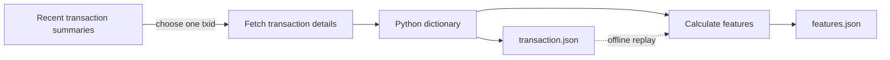

# Exercise 1: follow one transaction

The goal is to understand where the data comes from, what a transaction contains, and how we turn it into a small feature record. This exercise runs once and exits. It is the first small step toward milestone M0, not the full ingestion service.

## The data path



A **data path** is the sequence of places data moves through and the transformations applied along the way. In this exercise, HTTP brings the data into Python, one function transforms it, and local files retain it.

## Run it

Use Python 3.10 or newer. No package installation, Docker, or cloud account is needed.

From PowerShell in the project folder:

```powershell
python examples/01_trace_transaction.py --sample
```

This first run uses a bundled **synthetic teaching fixture**, with one input, two outputs, and a fee of 603 satoshis. It is not a real transaction and makes no HTTP requests. The supplied weight of 801 demonstrates rounding: virtual size is 201 vB, giving a fee rate of 3 sat/vB. Inspect this small example before downloading a real transaction.

Then try live mode:

```powershell
python examples/01_trace_transaction.py
```

The script makes two GET requests:

1. `/api/mempool/recent` supplies recent transaction summaries, from which we select one `txid`.
2. `/api/tx/{txid}` supplies that transaction's inputs, outputs, fee, weight, and status.

These shapes are documented in the [mempool API documentation source](https://github.com/mempool/mempool/blob/master/frontend/src/app/docs/api-docs/api-docs-data.ts) and the [Esplora API reference](https://github.com/Blockstream/esplora/blob/master/API.md).

The transaction may be confirmed or become unavailable between those requests. Recent summaries are a small snapshot, not a complete live stream. We will learn streaming later.

Successful execution writes:

```text
data/learning/transaction.json   # API transaction JSON, or the labeled sample
data/learning/features.json      # The small record we computed
```

Each successful live or sample run replaces these two learning files. They are ignored by Git. The sample includes an `_example_note` marker that is printed again during replay. This intentionally simple example keeps the latest snapshot; the archival milestone will introduce durable, versioned history.

## Inspect the raw data

Open `data/learning/transaction.json` in your editor, or explore it in PowerShell:

```powershell
$transaction = Get-Content data/learning/transaction.json -Raw | ConvertFrom-Json
$transaction.txid
$transaction.vin.Count
$transaction.vout.Count
$transaction.vin[0]
$transaction.vout[0]
```

Focus on these fields:

| Field | What to notice |
| --- | --- |
| `txid` | The identifier used to fetch and connect records for this transaction |
| `vin` | Inputs; inspect the previous transaction/output reference and any `prevout` details |
| `vout` | Outputs; inspect their values and spending scripts |
| `fee` | The provider's transaction fee, in satoshis |
| `weight` | The size measure used here to derive virtual size |
| `status` | The provider's confirmation status when this response was fetched |

A transaction spends existing outputs and creates new outputs. Input/output counts therefore do not tell you how many people were involved. An output may be change returning to the sender, so summed output value is not necessarily the payment amount.

## Read the script in three pieces

Open [the example](../../examples/01_trace_transaction.py).

**`fetch_json()` handles I/O.** It sends an HTTP request, waits for the response, and decodes JSON into Python lists/dictionaries. Its result depends on an external service. The timeout prevents it from waiting indefinitely.

**`extract_features()` handles transformation.** It is now shared in [features.py](../../src/blockpulse/features.py). It accepts the decoded transaction and returns counts, summed output value, fee, virtual size, and fee rate. It does not fetch anything or write any files. Both this exercise and the Phase 0 processor use it.

**`main()` connects the steps.** It chooses live, sample, or saved input, calls the feature function, prints the result, and saves files. Read its four printed steps alongside the diagram.

Virtual size is transaction weight divided by four, rounded up. The script uses `(weight + 3) // 4` for integer ceiling division, then calculates fee rate as `fee / vsize`. [Source: BIP 141](https://github.com/bitcoin/bips/blob/master/bip-0141.mediawiki#transaction-size-calculations).

For an illustrative transaction with a 600-satoshi fee and weight 800:

```text
virtual size = ceil(800 / 4) = 200 vB
fee rate     = 600 / 200     = 3 sat/vB
```

The script rounds the displayed fee-rate feature to six decimal places. It keeps satoshi amounts as integers. Confirmation status is printed as context and excluded from the feature vector.

## Replay the same input

After a successful sample or live run:

```powershell
$before = Get-Content data/learning/features.json -Raw
python examples/01_trace_transaction.py --replay
$after = Get-Content data/learning/features.json -Raw
$before -eq $after
```

The last line should print `True` if the script and saved input are unchanged. Replay reads `transaction.json` and makes no HTTP requests. You can run it with the internet disconnected. It replays whichever input you saved most recently, including the synthetic sample if that was your last run.

The saved confirmation status remains a historical snapshot; replay does not refresh it. The feature values also remain the same because both modes call the same function on the same input.

This is the project's first reproducibility check: **same input + same feature code = same features**. Later, Kafka and Parquet will change how input is delivered and retained, while this principle stays the same.

## Small experiments to try

1. Trace `n_out` from the source JSON to `len(transaction["vout"])` and then to `features.json`.
2. Check the fee-rate calculation by hand for the transaction you captured.
3. Add a feature named `largest_output_sat` using the values in `vout`. Replay and inspect the new result. When changing the shared schema, update `FEATURE_SET_VERSION` and `FEATURE_NAMES` in `features.py` so the CSV exporter stays consistent.
4. Sketch where a queue would sit if fetching and feature computation ran as separate processes. Consider what would happen if the feature process stopped halfway through.

Stop after the first two if the fields are still unfamiliar. Understanding one record is the goal of this session.

## If it fails

- **`python` is not found:** select/install a supported Python interpreter or try the Windows `py` launcher.
- **Replay file is missing:** run `--sample` or live mode successfully once to create it.
- **HTTP error or timeout:** check network access and try later. For a 429, respect the provider's retry guidance rather than repeatedly rerunning.
- **Transaction became unavailable:** a later live run may select a different recent transaction.
- **Missing field or invalid JSON:** inspect the response/error; the source contract may differ. Keep that evidence for M0 rather than filling missing values with zero.

## What comes next

The [Phase 0 capture and replay commands](../PHASE0.md) now implement the next step: bounded WebSocket capture, original message storage, duplicate handling, and offline feature tables. Use those observations to guide the Kafka ingestion design.

This example does not yet measure sustainable API limits, provide complete mempool coverage, or finish M0. It establishes the smallest readable path we can use to learn those things.

## Initial verification

On 2026-10-08, sample mode and offline replay passed: replay made no HTTP calls, preserved the input file, and produced byte-identical feature output. Checks also covered virtual-size rounding, invalid weight, and confirmation-status independence. The development shell blocked an initial network request; a subsequent live verification did not finish and was stopped. Treat live API connectivity as unverified in this environment. Sample mode and offline replay are the reproducible starting point.
